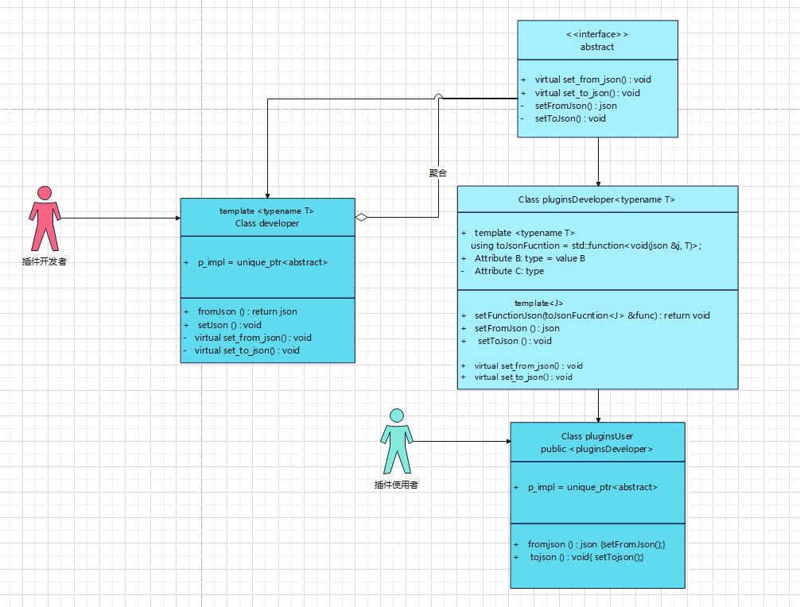

# pageGeneration json页面生成器

## 实现功能

**# nlohmann_json序列化任何结构体**


**#### 介绍**

C++实现：nlohmann_json序列化任何结构体，使用较为复杂的json时，可以令开发者序列化和反序列化json，令使用者脱离json库，通过修改结构体即可实现对json的修改，类似于go的struct到json的映射。

```json
{
    "addDev":{
        "key":"1"
    }
}
// 旧的json
```

```json
{
    "addName:{
    "str":"str"
}
}
// 新的json,
struct addName
{
    string str; // 结构体
}
```

想要的json

```json
{
    "addDev":{
        "key":"1",
        "addName:{
    		"str":"str"
		}
    }
}
// 或者
{
    "addDev":{
        "key":"1"
    },
    "addName:{
    	"str":"str"
	}
}
```

## 角色分类


此时:developer就在扮演"C"的角色

```cpp
#include <iostream>
#include <memory>
#include <nlohmann/json.hpp>
class A
{
public:
    virtual void Sub() = 0;
private:
    void setSub(){}
};
class B : public A
{
public:
    void seSub(){ Sub();}
private:
    virtual void Sub() override final{}
};
class C : public A
{
public:
    C():pmil_(std::make_unique<B>())
    {
        pmil_->Sub();
    }
    virtual void Sub()override final{}
    std::unique_ptr<A> pmil_;
};
class D : public B
{};
int main() {
    C c;
    c.Sub();
    D d;
    d.seSub();
    return 0;
}
```

所有结构体和类都需要定义在同一个命名空间中，udt

### 方案一

**插件使用者**

通过继承类模板，识别类模板的<> 模板参数对其进行序列化

缺点：过于死板，无法序列化多个json结构体出来

```cpp
namespace udt
{
/**
 * @brief json插件使用者,不需要知道json的实现方法,用lib封装后，也不会知道
 *
 */

class pluginsUser : public pluginsDeveloper<udt::pluginTest>
{
private:
    /* data */
public:
    void tojson() { setToJson(); }
    void tojson(void *p, TYPE_NAME name) { setToJson(p, name); }
    json fromjson(void *p) { setFromJson(p); }
    pluginsUser() {}
    pluginsUser(udt::testPlugins t, udt::udtTest utest) : pluginsDeveloper(t, utest) {}
    ~pluginsUser() {}
};


} // namespace udt
```


```cpp
int main()
{
    pluginsUser     users;
     users.tojson();
    // 自动序列化udt::pluginTest
}
```

**插件开发者**

在虚函数中协商重写方法

```cpp
 virtual void set_to_json() override final
    {
        json            j;
        udt::pluginTest t{ "测试1" };
        j = t;
        std::cout << "set_to_json = " << j << std::endl;

        // testJson();
    }
```

### 方案二

**插件使用者**

使用void*重载的成员函数，对udt::udtTest进行序列化，并且设置枚举类型。

缺点：需要开发者进行协商，根据增加的时候，需要新增case和枚举，不够符合开闭原则。


```cpp

int main()
{
    pluginsUser     users1;
    auto tp = reinterpret_cast<udt::udtTest *>(&t);
    users1.tojson(tp, TYPE_NAME::UDT_TEST);
}
```

**插件开发者**

需要由开发者写好固定的解析函数，巧妙利用operator=

解析函数：略

```cpp
enum TYPE_NAME
{
    TEST_PLUGINS    = 0,
    UDT_PLUGIN_TEST = 1,
    UDT_TEST        = 2,
};
// 枚举类型，由开发者进行添加
static void to_json(json &j, const udt::testPlugins &f)
{
    j = json{ { "name", f.pluginsName } };
    std::cout << "j = " << j << std::endl;
}
```


```cpp
virtual void set_to_json(void *p, TYPE_NAME name) override final
    {
        switch (name)
        {
            case TYPE_NAME::UDT_PLUGIN_TEST:
            {
                auto tmp1 = reinterpret_cast<udt::pluginTest *>(p);

                json j1;
                j1 = *tmp1;
                std::cout << "set to_json udt::pluginTest   " << j1 << std::endl;
            }
            break;
            case TYPE_NAME::TEST_PLUGINS:
            {
                auto tmp2 = reinterpret_cast<udt::testPlugins *>(p);
                json j2;
                j2 = *tmp2;

                std::cout << "set to_json udt::testPlugins" << j2 << std::endl;
            }
            default:
            {
                auto tmp3 = reinterpret_cast<udt::udtTest *>(p);
                json j3;
                j3 = *tmp3;
                std::cout << "set_to_json udt::udtTest" << j3 << std::endl;
                break;
            }
        }
    }
```

### 方案三

由使用者自定义json解析方式，并且设置回调函数

开发者先填充数据先通过继承的类模板参数

template <typename S>

然后设置一个泛化类型出来，如下

**使用者**

这里选择做一个重载shared_ptr的示例，是因为考虑到使用者想序列化一个类，并且用到void*和char *的情况，可以自定义删除器，或者保留地址空间不删除，进行std::move

```cpp
template <typename T>
using toJsonFucntion = std::function<void(json &j, T)>;

// 自定义解析函数
static void testTemp(json &j, std::shared_ptr<udt::udtTest> p)
{
    j = p;
    std::cout << "testTemp = " << j << std::endl;
}
int main()
{
   pluginsUser     users;
   toJsonFucntion<shared_ptr<udt::udtTest>> f2 =
   std::bind(testTemp, std::placeholders::_1, std::placeholders::_2);
	// 可以由开发者决定何时回调该函数
}
```

**开发者**

```cpp
template <typename S>
class pluginsDeveloper : public udt::abstract
{
  // …… 泛化类型，由开发者和使用者进行协商，该结构
    void setFunctionJson(toJsonFucntion<S> &func)
    {
        json            j;
        udt::pluginTest p{ "plugins" };
        m_function = func;
        m_function(j, p); // 启动回调函数
    }
};
```

### 方案四

由开发者和使用者进行协商，对某个类型进行特化处理，就不需要走泛型了，提供复用率，并且由开发者或者使用者协商调用时机。并且可以自定义序列化到map<>或者json中

**插件开发者**

```cpp
template <typename S>
class pluginsDeveloper : public udt::abstract
{
    // ……
    /**
     * @brief Set the Function Json object
     *
     * @tparam DUMMY shared_ptr<udt::udtTest>的模板特化
     * @param N
     */
    template <typename DUMMY = std::shared_ptr<udt::udtTest>>
    void setFunctionJson(toJsonFucntion<DUMMY> &N)
    {
        json                                          j;
        toJsonFucntion<std::shared_ptr<udt::udtTest>> func;
        func = N;
        std::shared_ptr<udt::udtTest> p;
        p.reset(new udt::udtTest{ "DUMMY" });
        func(j, p);
    }
};
```

**插件使用者**

```cpp
static void map_json(map<string, string> j, shared_ptr<udt::udtTest> f)
{
    // j = json{ { "plugins", f.plugins } };
    j["str"] = f->str;
    std::cout << "users map " << j["str"] << std::endl;
}

template <typename T1, typename T2>
using toJsonFucntionMap = std::function<void(T1 j, T2 m)>;
int main()
{
    pluginsUser     users;
     map<string, string>                                              m1;
    toJsonFucntionMap<map<string, string>, shared_ptr<udt::udtTest>> fs =
        std::bind(map_json, m1, udtest);
    // fs(m1, udtest);
    users.setFunctionJson(fs);
}
```

### 方案五

开发者特化某个类型，由开发者自己定义，填充数据去解析，但是数据类型需要被解析的双方能够协商一致。


```cpp
int main()
{
    toJsonFucntion<shared_ptr<udt::udtTest>> f2 =
    std::bind(testTemp, std::placeholders::_1, std::placeholders::_2);
    users.setFunctionJson(f2);
}
```

